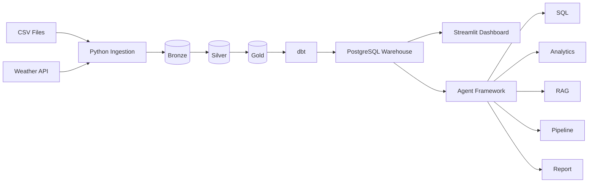
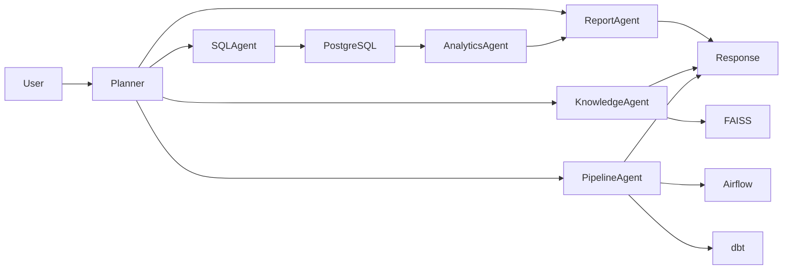

# 🚀 DataPilot

> **Intelligent Data Engineering & Analytics Platform**

**From Raw Data to Intelligent Decisions.**

------------------------------------------------------------------------

## 📖 Overview

DataPilot is an end-to-end **Modern Data Platform** that combines **Data
Engineering**, **Business Intelligence**, and **Agentic AI** into a
single production-inspired platform.

The platform automates the complete analytics lifecycle---from ingesting
raw data to delivering AI-powered business insights. It follows the
**Medallion Architecture (Bronze → Silver → Gold)**, orchestrates
workflows using **Apache Airflow**, transforms data with **dbt**, stores
analytics-ready datasets in **PostgreSQL**, visualizes insights through
**Streamlit**, and enables natural language interaction through a
**multi-agent AI assistant** powered by Google Gemini.

------------------------------------------------------------------------

## ✨ Key Features

### 🏗️ Data Engineering

-   Medallion Architecture
-   Automated ETL Pipelines
-   PostgreSQL Data Warehouse
-   Apache Airflow Orchestration
-   dbt Transformations & Testing
-   Weather API Integration
-   Dockerized Infrastructure

### 📊 Business Intelligence

-   Executive Dashboard
-   Sales Analytics
-   Customer Analytics
-   Product Analytics
-   Seller Analytics
-   Weather Analytics
-   Data Quality Dashboard

### 🤖 Agentic AI

-   Multi-Agent Architecture
-   Natural Language to SQL
-   Business Analytics Agent
-   Knowledge Agent (RAG)
-   Pipeline Monitoring Agent
-   Executive Report Generation

------------------------------------------------------------------------

## 🏛️ High-Level Architecture



------------------------------------------------------------------------

## 🤖 AI Workflow



------------------------------------------------------------------------

## 🛠️ Technology Stack

  Category          Technologies
  ----------------- -------------------------
  Language          Python 3.11
  Database          PostgreSQL + pgvector
  Orchestration     Apache Airflow
  Transformation    dbt Core
  Dashboard         Streamlit
  AI                Google Gemini
  Vector Store      FAISS
  Containers        Docker & Docker Compose
  Data Processing   Pandas, NumPy
  ORM               SQLAlchemy
  Visualization     Plotly

------------------------------------------------------------------------

## 📂 Project Structure

``` text
DataPilot/
├── agents/
├── app/
├── config/
├── dags/
├── dbt_project/
├── docker/
├── docs/
├── ingestion/
├── warehouse/
├── tests/
├── docker-compose.yml
├── requirements.txt
└── README.md
```

------------------------------------------------------------------------

## 🚀 Getting Started

### Prerequisites

-   Python 3.11+
-   Docker & Docker Compose
-   Git

### Clone

``` bash
git clone https://github.com/Dheerajyadav1/datapilot-platform.git
cd DataPilot
```

### Install

``` bash
python -m venv .venv
```

Windows

``` bash
.venv\Scripts\activate
```

Linux/macOS

``` bash
source .venv/bin/activate
```

``` bash
pip install -r requirements.txt
```

### Configure

Create a `.env` file and configure:

-   PostgreSQL credentials
-   pgAdmin credentials
-   Gemini API Key
-   Airflow UID

### Start Services

``` bash
docker compose up -d
```

### Run Pipelines

``` bash
python warehouse/pipeline.py
python ingestion/pipeline.py
```

### Execute dbt

``` bash
cd dbt_project
dbt run
dbt test
```

### Build RAG Index

``` bash
python -m agents.rag.build_index
```

### Launch Dashboard

``` bash
streamlit run app/Home.py
```

------------------------------------------------------------------------

## 💬 Example Questions

### Analytics

-   Show the top 10 customers by revenue.
-   Which product category generated the highest sales?
-   Show monthly revenue trends.

### Knowledge

-   Explain the Medallion Architecture.
-   What is dbt?
-   How does the SQL Agent work?

### Pipeline

-   Is Airflow running?
-   Did dbt tests pass?
-   Show pipeline health.

### Reports

-   Generate an executive sales report.
-   Create a monthly business summary.

------------------------------------------------------------------------

## 📸 Screenshots

Add screenshots under:

``` text
assets/screenshots/
```

Suggested:

-   dashboard.png
-   sales.png
-   customers.png
-   assistant.png
-   pipeline.png

------------------------------------------------------------------------

## 🗺️ Roadmap

-   ✅ Dockerized Infrastructure
-   ✅ Medallion Architecture
-   ✅ Apache Airflow
-   ✅ dbt Models & Tests
-   ✅ Streamlit Dashboard
-   ✅ Multi-Agent AI Framework
-   ✅ Natural Language to SQL
-   ✅ RAG Knowledge Assistant
-   ✅ Pipeline Monitoring
-   ✅ Executive Report Generation

### Future

-   Authentication
-   Real-time Streaming
-   Multi-LLM Support
-   Cloud Deployment
-   CI/CD
-   Observability
-   Kubernetes

------------------------------------------------------------------------

## 👨‍💻 Author

**Dheeraj Yadav**

B.Tech CSE, IIIT Bhagalpur

Specialization: Data Engineering • Analytics Engineering • Agentic AI

[GitHub](https://github.com/Dheerajyadav1) | [Repository](https://github.com/Dheerajyadav1/datapilot-platform)

LinkedIn: https://www.linkedin.com/in/dheerajyadav1/

------------------------------------------------------------------------

## 📄 License

This project is licensed under the MIT License.

------------------------------------------------------------------------

⭐ If you found this project useful, consider starring the repository.
