<div align="center">

# 🚀 DataPilot

### Intelligent Data Engineering & Analytics Platform

**From Raw Data to Intelligent Decisions.**

*An end-to-end Modern Data Stack that combines Data Engineering, Business Intelligence, and Agentic AI into a unified analytics platform.*

<br>

<!-- Replace with your banner -->


<br><br>


<br>


</div>

## 📖 Overview

Modern organizations generate massive volumes of data every day, but transforming that data into reliable, actionable insights requires much more than dashboards. It demands scalable data pipelines, robust transformation workflows, reliable data quality checks, and intelligent analytics that enable both technical and non-technical users to make informed decisions.

**DataPilot** is a production-inspired **Intelligent Data Engineering & Analytics Platform** that brings together the complete modern data lifecycle into a single, integrated ecosystem. The platform automates data ingestion, orchestrates ETL workflows using **Apache Airflow**, transforms raw data into analytics-ready datasets with **dbt** following the **Medallion Architecture (Bronze → Silver → Gold)**, stores curated data in a **PostgreSQL Data Warehouse**, and delivers interactive business dashboards through **Streamlit**.

What differentiates DataPilot from a traditional analytics platform is its **Agentic AI Framework**. Instead of relying solely on dashboards and predefined SQL queries, DataPilot enables users to interact with their data using natural language. A multi-agent orchestration layer intelligently routes requests to specialized AI agents capable of generating SQL queries, performing business analysis, retrieving project knowledge using Retrieval-Augmented Generation (RAG), monitoring pipeline health, and generating executive business reports.

By combining modern data engineering practices with intelligent AI agents, DataPilot demonstrates how organizations can move beyond static reporting toward an autonomous analytics platform that assists users throughout the entire decision-making process—from raw data ingestion to AI-powered business intelligence.

---

### 🎯 Project Objectives

DataPilot was designed with the following goals:

- Build a production-inspired Modern Data Stack using industry-standard technologies.
- Implement the Medallion Architecture for scalable and maintainable data warehousing.
- Automate data ingestion, transformation, and orchestration workflows.
- Deliver interactive dashboards for business stakeholders.
- Integrate Agentic AI to enable natural language analytics and intelligent decision support.
- Demonstrate best practices in Data Engineering, Analytics Engineering, and AI system design within a single unified platform.

## 💡 Why DataPilot?

Over the past decade, organizations have invested heavily in building modern data platforms. Technologies like **Apache Airflow**, **dbt**, **PostgreSQL**, and **Streamlit** have significantly improved how data is ingested, transformed, and visualized. However, one challenge still remains:

> **Accessing insights often requires technical expertise.**

Business users frequently depend on data teams to write SQL queries, investigate pipeline failures, explain data models, or generate executive reports. This creates bottlenecks that slow down decision-making and reduce the accessibility of data across an organization.

DataPilot was built to bridge this gap by combining the **Modern Data Stack** with **Agentic AI**.

Instead of treating Artificial Intelligence as a standalone chatbot, DataPilot integrates AI directly into the data platform through a multi-agent architecture. Each agent is responsible for a specialized task—query generation, business analytics, knowledge retrieval, pipeline monitoring, or executive reporting—working together to provide intelligent, context-aware assistance.

This approach transforms the platform from a traditional dashboard into an intelligent data companion capable of helping users understand, analyze, and interact with data using natural language.

### 🚀 What Makes DataPilot Different?

Unlike conventional analytics projects that stop after building dashboards, DataPilot demonstrates how modern data engineering and AI can work together within a single platform.

Key differentiators include:

- 🤖 **Agentic AI Framework** that intelligently routes user requests to specialized AI agents.
- 🏗️ **Production-inspired Modern Data Stack** following industry best practices.
- 📦 **Medallion Architecture** for scalable and maintainable data warehousing.
- ⚙️ **Automated orchestration** using Apache Airflow.
- 📈 **Analytics-ready transformations** powered by dbt.
- 💬 **Natural Language to SQL** for intuitive data exploration.
- 📚 **Retrieval-Augmented Generation (RAG)** for project-aware knowledge retrieval.
- 🔍 **Pipeline monitoring and diagnostics** through AI-assisted operational insights.
- 📊 **Interactive dashboards** delivering business intelligence across multiple domains.

DataPilot is not just a dashboard, an ETL pipeline, or an AI assistant—it is a unified platform that demonstrates how modern data engineering, analytics engineering, and generative AI can be combined to build intelligent decision-support systems.

## ✨ Key Features

DataPilot combines the capabilities of a modern data platform with the intelligence of autonomous AI agents, providing an end-to-end ecosystem for data engineering, analytics, and decision support.

### 🏗️ Modern Data Engineering

Build reliable, scalable, and production-inspired data pipelines.

| Feature | Description |
|----------|-------------|
| **Automated Data Ingestion** | Collects data from multiple sources including CSV files and external APIs. |
| **Medallion Architecture** | Organizes data into Bronze, Silver, and Gold layers for maintainability and scalability. |
| **PostgreSQL Data Warehouse** | Centralized analytical database optimized for reporting and business intelligence. |
| **Apache Airflow Orchestration** | Schedules and automates end-to-end ETL workflows. |
| **Incremental Data Processing** | Efficiently processes new data without rebuilding the entire warehouse. |
| **Dockerized Infrastructure** | Fully containerized environment for consistent deployment and development. |

---

### ⚙️ Analytics Engineering

Transform raw data into reliable, analytics-ready datasets.

| Feature | Description |
|----------|-------------|
| **dbt Models** | Modular SQL transformations following analytics engineering best practices. |
| **Data Quality Tests** | Built-in schema, uniqueness, relationship, and integrity validations. |
| **Reusable Data Models** | Clean and maintainable transformation logic for long-term scalability. |
| **Analytics-Ready Gold Layer** | Curated datasets optimized for dashboards and AI-driven analytics. |

---

### 📊 Business Intelligence

Deliver meaningful insights through interactive dashboards.

| Dashboard | Description |
|-----------|-------------|
| 📈 Executive Dashboard | High-level KPIs and business overview. |
| 💰 Sales Analytics | Revenue trends, sales performance, and profitability analysis. |
| 👥 Customer Analytics | Customer segmentation, purchasing behavior, and lifetime value analysis. |
| 📦 Product Analytics | Product performance, inventory insights, and category analysis. |
| 🛍️ Seller Analytics | Seller performance and marketplace evaluation. |
| 🌦️ Weather Analytics | Weather-based business insights and external factor analysis. |
| ✅ Data Quality Dashboard | Warehouse health, validation results, and data quality metrics. |

---

### 🤖 Agentic AI Framework

An intelligent multi-agent ecosystem that enables natural language interaction with the platform.

| Agent | Responsibility |
|--------|---------------|
| 🧠 **Planner** | Understands user intent and determines the optimal execution plan. |
| 💻 **SQL Agent** | Converts natural language into optimized PostgreSQL queries. |
| 📊 **Analytics Agent** | Generates business insights, trend analysis, and actionable recommendations. |
| 📚 **Knowledge Agent** | Uses Retrieval-Augmented Generation (RAG) to answer project and documentation-related questions. |
| ⚙️ **Pipeline Agent** | Monitors Airflow, dbt, Docker, and pipeline health. |
| 📄 **Report Agent** | Produces executive-level business reports and summaries. |

---

### 🚀 AI Capabilities

Empower users to interact with data using natural language.

- 💬 Natural Language to SQL
- 📈 Automated Business Insights
- 📄 Executive Report Generation
- 📚 Retrieval-Augmented Generation (RAG)
- 🔍 Intelligent Pipeline Monitoring
- 🤖 Multi-Agent Collaboration
- 🧠 Context-Aware Query Routing
- ⚡ AI-Assisted Decision Support

---

### 🔒 Platform Reliability

Designed with production-inspired engineering practices.

- Containerized deployment using Docker
- Modular and scalable architecture
- Separation of concerns across platform components
- Centralized configuration management
- Reusable service and repository layers
- Structured logging and monitoring
- Extensible AI agent framework

# 🏛️ System Architecture

DataPilot follows a modern, layered architecture that separates data ingestion, transformation, analytics, visualization, and AI into independent yet interconnected components. This modular design improves scalability, maintainability, and extensibility while allowing each layer to evolve independently.

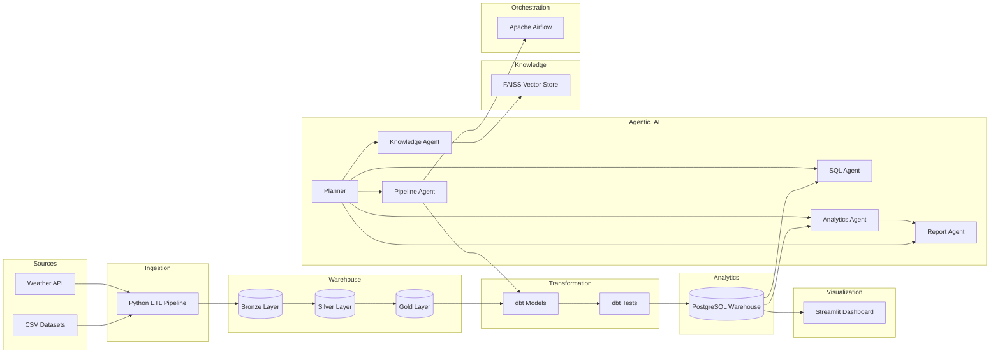

---

## 🏗️ Architecture Overview

DataPilot is organized into six major layers:

| Layer | Responsibility |
|--------|----------------|
| **Data Sources** | Collects structured data from CSV datasets and external APIs. |
| **Ingestion Layer** | Automates extraction, validation, and loading into the warehouse. |
| **Data Warehouse** | Implements the Medallion Architecture (Bronze → Silver → Gold). |
| **Transformation Layer** | Uses dbt to clean, model, validate, and document datasets. |
| **Analytics Layer** | Stores analytics-ready data inside PostgreSQL for dashboards and AI. |
| **Presentation Layer** | Delivers interactive dashboards and AI-powered business insights. |

The modular architecture ensures that every component—from ingestion to AI—can evolve independently while remaining part of a unified analytics platform.

# 🥉 Medallion Architecture

DataPilot follows the **Medallion Architecture**, a layered data engineering approach that progressively improves data quality and prepares datasets for analytics and decision-making.

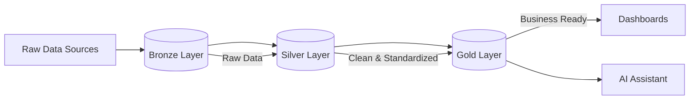

### Bronze Layer

The Bronze layer stores raw ingested data with minimal transformation. It serves as the immutable source of truth and preserves historical records.

### Silver Layer

The Silver layer cleans, validates, standardizes, and enriches the raw data. Duplicate records, inconsistent values, and missing information are handled during this stage.

### Gold Layer

The Gold layer contains business-ready datasets optimized for reporting, dashboarding, AI agents, and downstream analytics.

# ⚙️ End-to-End Data Pipeline Workflow

DataPilot automates the complete journey of data—from ingestion to AI-powered business intelligence. Every stage of the pipeline is designed to ensure data quality, reliability, and scalability while minimizing manual intervention.

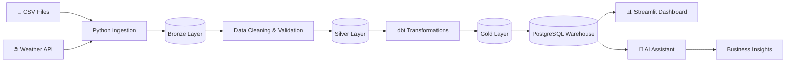

---

## 🔄 Workflow Overview

The DataPilot pipeline follows a structured workflow that transforms raw datasets into analytics-ready information while maintaining data integrity throughout every stage.

### 1️⃣ Data Ingestion

The platform ingests data from multiple sources, including structured CSV datasets and external APIs such as weather services. Python-based ETL pipelines validate incoming records before loading them into the warehouse.

**Responsibilities**

- Read raw datasets
- Fetch external API data
- Validate incoming records
- Handle missing or invalid values
- Load raw data into the Bronze layer

---

### 2️⃣ Bronze Layer

The Bronze layer stores data in its original format with minimal transformation. This layer serves as the immutable source of truth and preserves historical information for auditing and recovery purposes.

---

### 3️⃣ Silver Layer

Data is cleaned, standardized, enriched, and validated before moving to the Silver layer.

Typical operations include:

- Removing duplicates
- Standardizing data formats
- Handling null values
- Type conversions
- Data enrichment
- Basic business validations

---

### 4️⃣ Gold Layer

The Gold layer contains business-ready datasets specifically designed for analytics, reporting, dashboards, and AI applications.

Examples include:

- Sales fact tables
- Customer dimensions
- Product dimensions
- Seller dimensions
- Weather analytics
- Executive KPIs

---

### 5️⃣ dbt Transformations

dbt transforms curated warehouse data into reusable analytical models while ensuring quality through automated testing.

DataPilot uses dbt for:

- SQL model development
- Incremental transformations
- Data quality validation
- Schema testing
- Documentation generation
- Dependency management

---

### 6️⃣ Apache Airflow Orchestration

Apache Airflow orchestrates the complete data pipeline by scheduling and monitoring every stage of the workflow.

Responsibilities include:

- Pipeline scheduling
- Task dependencies
- Retry handling
- Failure monitoring
- Logging
- Workflow automation

---

### 7️⃣ PostgreSQL Analytics Warehouse

The transformed Gold-layer datasets are stored in PostgreSQL, serving as the central analytical repository for dashboards and AI agents.

This warehouse powers:

- Executive dashboards
- Business analytics
- SQL Agent
- Analytics Agent
- Report Agent

---

### 8️⃣ Streamlit Dashboard

Business users interact with curated datasets through an intuitive dashboard offering:

- Executive KPIs
- Sales Analytics
- Customer Analytics
- Product Analytics
- Seller Analytics
- Weather Analytics
- Data Quality Monitoring

---

### 9️⃣ AI-Powered Decision Support

The same analytics-ready warehouse is leveraged by DataPilot's Agentic AI Framework, enabling users to ask questions in natural language instead of writing SQL manually.

The AI assistant can:

- Generate SQL queries
- Analyze business performance
- Explain project architecture
- Monitor pipeline health
- Produce executive reports

This creates a unified platform where traditional business intelligence and generative AI work together to accelerate data-driven decision-making.

# 🤖 Multi-Agent AI Architecture

One of the defining capabilities of **DataPilot** is its **Agentic AI Framework**, a modular, multi-agent system that enables users to interact with the platform using natural language.

Instead of relying on a single Large Language Model (LLM) for every task, DataPilot adopts a **specialized agent architecture** where each agent is responsible for solving a specific problem. An intelligent planner analyzes the user's request, determines the appropriate execution strategy, and orchestrates the collaboration between multiple agents when required.

This design improves scalability, maintainability, and allows each agent to evolve independently while sharing a common execution context.

---

## 🧠 Agent Orchestration Workflow

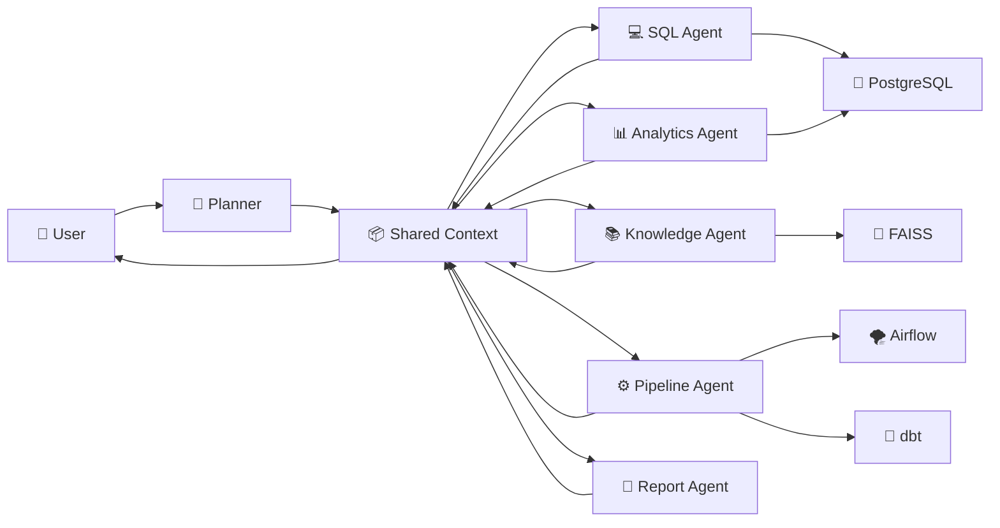

---

## 🏗️ Agent Responsibilities

| Agent | Responsibility |
|--------|---------------|
| 🧠 **Planner** | Understands user intent and creates an execution plan. |
| 💻 **SQL Agent** | Converts natural language into optimized PostgreSQL queries and executes them. |
| 📊 **Analytics Agent** | Generates business insights, identifies trends, and provides actionable recommendations. |
| 📚 **Knowledge Agent** | Retrieves project knowledge using Retrieval-Augmented Generation (RAG). |
| ⚙️ **Pipeline Agent** | Monitors Airflow, dbt, Docker, and overall pipeline health. |
| 📄 **Report Agent** | Produces executive summaries and professional business reports. |

---

## 📦 Shared Execution Context

Instead of passing information directly between agents, DataPilot uses a centralized **Agent Context**.

The context acts as shared memory throughout the execution lifecycle and stores:

- User question
- Execution plan
- Generated SQL
- Query results
- Business insights
- Recommendations
- Pipeline status
- Retrieved knowledge
- Execution trace
- Final response

This enables multiple agents to collaborate without creating tight dependencies between them.

---

## 🔄 Execution Lifecycle

Every request follows a structured workflow:

```text
User Query
      │
      ▼
Planner
      │
      ▼
Execution Plan
      │
      ▼
Relevant Agent(s)
      │
      ▼
Tools & Data Sources
      │
      ▼
Shared Context Update
      │
      ▼
Final AI Response
```

For example, when a user asks:

> *"Generate an executive report showing the top-performing customers."*

The platform executes the following sequence:

1. The **Planner** classifies the request as a reporting task.
2. The **SQL Agent** generates and executes the required SQL query.
3. The **Analytics Agent** analyzes the returned dataset and extracts business insights.
4. The **Report Agent** converts those insights into a professional executive report.
5. The final response is returned to the user through the AI Assistant.

This collaborative workflow enables DataPilot to solve complex tasks by combining the strengths of multiple specialized agents.

---

## 🔧 Agent Tooling

Agents interact with the platform through a reusable tool layer rather than directly accessing external systems.

Current tools include:

| Tool | Purpose |
|------|---------|
| 🐘 Database Tool | Execute SQL queries against PostgreSQL. |
| 🗂️ Metadata Tool | Retrieve warehouse schemas and metadata. |
| 📊 Chart Tool | Generate interactive Plotly visualizations. |
| 🌦️ Weather Tool | Access external weather information. |
| ⚙️ Pipeline Tool | Monitor Airflow, dbt, and pipeline health. |

This abstraction keeps agent logic clean while making the framework extensible for future integrations.

---

## 🚀 Why a Multi-Agent Architecture?

A single AI model can answer many questions, but specialized agents offer significant advantages for complex analytical workflows.

DataPilot's multi-agent design provides:

- **Modularity** — Each agent has a single responsibility.
- **Scalability** — New agents can be added without changing existing ones.
- **Maintainability** — Independent components simplify development and testing.
- **Reusability** — Agents share common infrastructure through the orchestration layer.
- **Extensibility** — New tools and capabilities can be integrated with minimal effort.
- **Intelligence** — Multiple agents can collaborate to solve complex business problems.

By separating responsibilities across specialized agents, DataPilot demonstrates how **Agentic AI** can be applied to modern data platforms to create intelligent, context-aware decision support systems.

# 🚀 Getting Started

Follow the steps below to set up and run **DataPilot** on your local machine.

---

## 📋 Prerequisites

Ensure the following software is installed before you begin.

| Software | Version |
|----------|---------|
| Python | 3.11+ |
| Docker | Latest |
| Docker Compose | Latest |
| Git | Latest |

It is also recommended to have:

- PostgreSQL Client (Optional)
- pgAdmin (Included through Docker)
- Visual Studio Code

---

# 📥 Clone the Repository

```bash
git clone https://github.com/<your-username>/DataPilot.git

cd DataPilot
```

---

# 🐍 Create a Virtual Environment

Windows

```bash
python -m venv .venv

.venv\Scripts\activate
```

Linux / macOS

```bash
python3 -m venv .venv

source .venv/bin/activate
```

---

# 📦 Install Dependencies

```bash
pip install -r requirements.txt
```

---

# ⚙️ Environment Configuration

Create a `.env` file in the project root.

```env
POSTGRES_HOST=postgres

POSTGRES_PORT=5432

POSTGRES_DB=agentic_db

POSTGRES_USER=postgres

POSTGRES_PASSWORD=your_password

PGADMIN_DEFAULT_EMAIL=admin@example.com

PGADMIN_DEFAULT_PASSWORD=your_password

AIRFLOW_UID=50000

GEMINI_API_KEY=your_api_key
```

---

# 🐳 Start the Platform

Launch all services using Docker Compose.

```bash
docker compose up -d
```

Verify that all containers are running.

```bash
docker ps
```

Expected services include:

- PostgreSQL
- pgAdmin
- Apache Airflow Scheduler
- Apache Airflow Webserver

---

# 🗄️ Initialize the Data Warehouse

Run the warehouse initialization pipeline.

```bash
python warehouse/pipeline.py
```

This step creates the required schemas, tables, and warehouse objects.

---

# 📥 Run Data Ingestion

Execute the ingestion pipeline.

```bash
python ingestion/pipeline.py
```

This loads raw data into the Bronze layer.

---

# 🔄 Execute dbt Models

Navigate to the dbt project.

```bash
cd dbt_project
```

Run transformations.

```bash
dbt run
```

Execute data quality tests.

```bash
dbt test
```

---

# 🧠 Build the Knowledge Base

Generate embeddings and create the FAISS vector index.

```bash
python -m agents.rag.build_index
```

This step only needs to be executed when project documentation changes.

---

# 📊 Launch the Dashboard

Start the Streamlit application.

```bash
streamlit run app/Home.py
```

The dashboard will be available at:

```
http://localhost:8501
```

---

# 🌪️ Airflow

Open Airflow:

```
http://localhost:8080
```

Login using your configured Airflow credentials.

From the Airflow UI you can:

- Trigger pipelines
- Monitor DAG executions
- View task logs
- Retry failed tasks

---

# 🐘 pgAdmin

Open pgAdmin:

```
http://localhost:5050
```

Use the credentials defined in your `.env` file.

You can inspect:

- Bronze Layer
- Silver Layer
- Gold Layer
- dbt Models
- Warehouse Tables

---

# ✅ Verify Installation

If everything has been configured correctly, you should be able to:

- Successfully start all Docker containers.
- Execute the Airflow DAG.
- Run dbt models and tests.
- Access the PostgreSQL warehouse.
- Open the Streamlit dashboard.
- Interact with the AI Assistant.
- Generate SQL queries using natural language.
- View analytics dashboards.

Congratulations! 🎉 DataPilot is now ready for use.

# 🤖 AI Assistant

One of DataPilot's most distinctive capabilities is its **Agentic AI Assistant**, designed to make interacting with data as simple as having a conversation.

Instead of manually writing SQL queries, navigating dashboards, or investigating pipeline failures, users can ask questions in natural language. DataPilot intelligently understands the request, routes it to the appropriate AI agent, retrieves the required information, and returns meaningful, context-aware responses.

The assistant is powered by a **multi-agent orchestration framework**, where specialized AI agents collaborate to perform complex analytical tasks while sharing a common execution context.

---

## 🧠 AI Capabilities

The AI Assistant can:

- 💻 Convert natural language into optimized PostgreSQL queries.
- 📊 Analyze business data and generate actionable insights.
- 📈 Identify trends, patterns, and anomalies.
- 📚 Answer project-related questions using Retrieval-Augmented Generation (RAG).
- ⚙️ Monitor Apache Airflow, dbt, and pipeline health.
- 📄 Generate executive-level business reports.
- 🔄 Dynamically orchestrate multiple AI agents to solve complex requests.

---

## 🤖 Available AI Agents

| Agent | Responsibility |
|--------|---------------|
| 🧠 Planner | Understands user intent and determines the execution strategy. |
| 💻 SQL Agent | Generates and executes PostgreSQL queries. |
| 📊 Analytics Agent | Produces business insights and recommendations. |
| 📚 Knowledge Agent | Retrieves contextual information from the project knowledge base. |
| ⚙️ Pipeline Agent | Monitors pipeline execution and platform health. |
| 📄 Report Agent | Generates executive reports and business summaries. |

---

# 💬 Example Interactions

### 📊 Business Analytics

**User**

> Show the top 10 customers by revenue.

**DataPilot**

- Generates an optimized SQL query.
- Retrieves the required data.
- Identifies the highest-value customers.
- Highlights key observations.
- Displays the result as a table.

---

### 📈 Trend Analysis

**User**

> What are the monthly sales trends?

**DataPilot**

- Queries historical sales data.
- Calculates month-over-month growth.
- Detects seasonal patterns.
- Provides business recommendations.

---

### 📦 Product Performance

**User**

> Which product category generated the highest revenue?

**DataPilot**

- Executes analytical SQL.
- Ranks product categories.
- Calculates contribution percentages.
- Summarizes findings.

---

### 📚 Project Knowledge

**User**

> Explain the Medallion Architecture used in this project.

**DataPilot**

- Retrieves relevant project documentation.
- Uses Retrieval-Augmented Generation (RAG).
- Produces an accurate, project-specific explanation.

---

### ⚙️ Pipeline Monitoring

**User**

> Is my data pipeline healthy?

**DataPilot**

- Checks Apache Airflow.
- Reviews dbt execution status.
- Identifies pipeline issues.
- Suggests corrective actions when required.

---

### 📄 Executive Reporting

**User**

> Generate an executive sales report for this month.

**DataPilot**

- Retrieves the required business metrics.
- Performs analytical reasoning.
- Generates a structured executive report containing:

- Executive Summary
- Key KPIs
- Business Insights
- Recommendations
- Conclusion

---

# 🔄 Multi-Agent Execution

Simple requests are handled by a single agent.

Complex requests trigger collaboration between multiple agents.

For example,

> Generate an executive report showing the top-performing customers.

The execution flow becomes:

```text
User Request
      │
      ▼
Planner
      │
      ▼
SQL Agent
      │
      ▼
PostgreSQL
      │
      ▼
Analytics Agent
      │
      ▼
Report Agent
      │
      ▼
Final Executive Report
```

This collaborative architecture enables DataPilot to solve complex analytical tasks while keeping each AI agent focused on a single responsibility.

---

# 🚀 Why It Matters

Traditional analytics platforms require users to:

- Navigate multiple dashboards.
- Write SQL queries.
- Understand database schemas.
- Monitor pipeline health manually.
- Interpret raw analytical results.

DataPilot removes these barriers by allowing users to interact with the platform using natural language.

Instead of asking **how to retrieve the data**, users can simply ask **what they want to know**.

This significantly improves accessibility for both technical and non-technical users while demonstrating how Agentic AI can enhance modern data platforms.

# 📸 Platform Showcase

DataPilot provides an integrated experience that combines interactive dashboards, modern data engineering pipelines, and an AI-powered analytics assistant into a single platform.

The screenshots below highlight the major capabilities of the platform.

---

## 🏠 Home Dashboard

The home dashboard provides a centralized entry point to the platform, offering quick navigation, platform overview, key metrics, and access to every analytical module.

<p align="center">
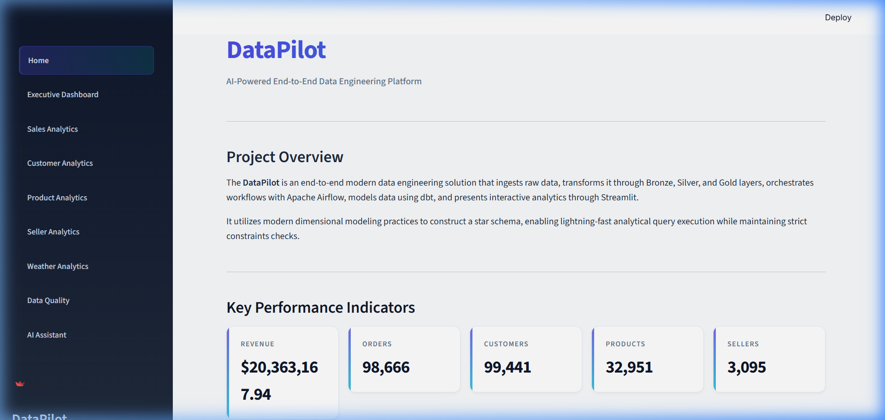
</p>

---

## 📊 Executive Dashboard

A high-level business intelligence dashboard designed for decision-makers.

Features include:

- Executive KPIs
- Revenue Overview
- Sales Trends
- Business Growth
- Performance Indicators

<p align="center">
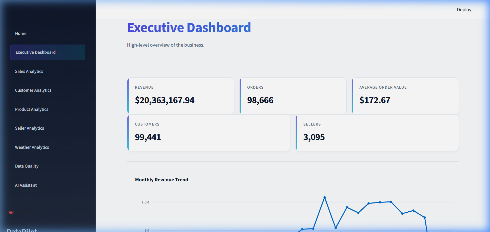
</p>

---

## 💰 Sales Analytics

Analyze business performance through detailed sales insights.

Highlights:

- Monthly Revenue
- Top Products
- Regional Performance
- Order Trends
- Revenue Distribution

<p align="center">
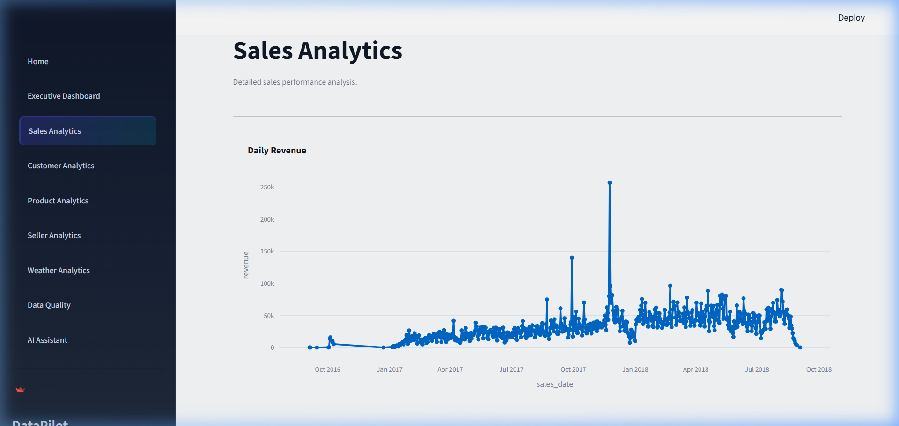
</p>

---

## 👥 Customer Analytics

Understand customer behavior using interactive visualizations.

Includes:

- Customer Segmentation
- Customer Lifetime Value
- Top Customers
- Purchase Behavior
- Customer Distribution

<p align="center">
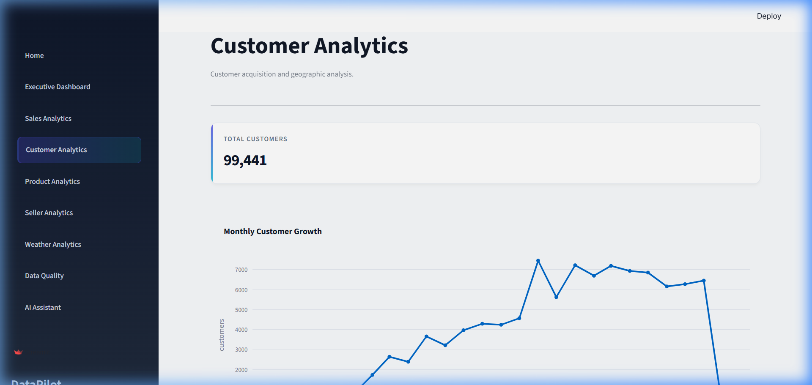
</p>

---

## 📦 Product Analytics

Gain deeper visibility into product performance.

Includes:

- Best Selling Products
- Category Performance
- Product Revenue
- Inventory Insights

<p align="center">
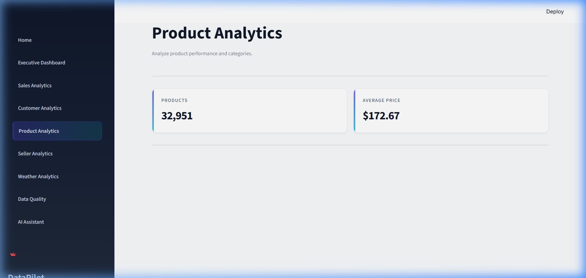
</p>

---

## 🛍️ Seller Analytics

Evaluate seller performance across multiple business dimensions.

Includes:

- Top Sellers
- Seller Revenue
- Regional Performance
- Sales Distribution

<p align="center">
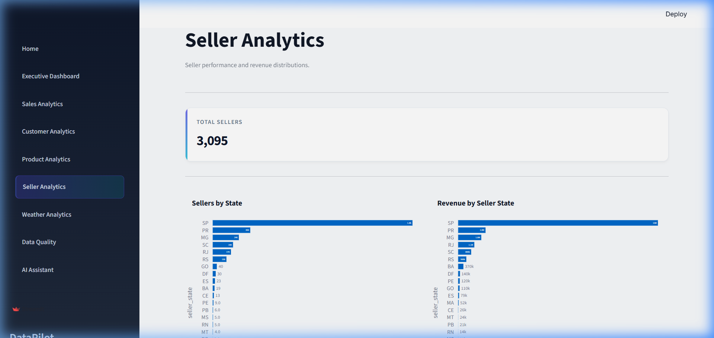
</p>

---

## 🌦️ Weather Analytics

Explore the relationship between external weather conditions and business performance.

Includes:

- Weather Trends
- Temperature Analysis
- Seasonal Insights
- Weather Impact

<p align="center">
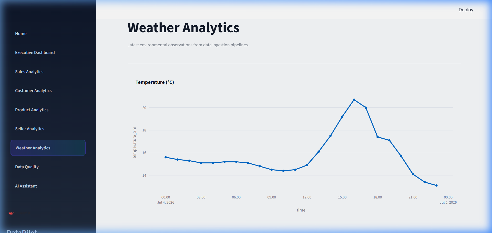
</p>

---

## ✅ Data Quality Dashboard

Monitor warehouse quality using dbt validation results.

Features:

- Schema Tests
- Integrity Checks
- Missing Values
- Duplicate Detection
- Quality KPIs

<p align="center">

</p>

---

# 🤖 AI Assistant

The AI Assistant enables users to interact with the platform using natural language.

Capabilities include:

- Natural Language → SQL
- Business Analytics
- Pipeline Monitoring
- Knowledge Retrieval
- Executive Reporting

<p align="center">
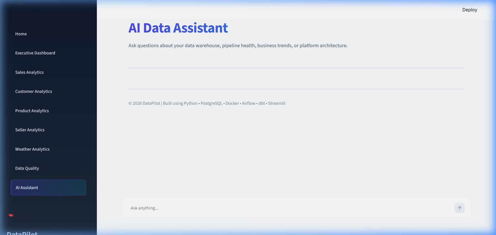
</p>

---

## ⚙️ Pipeline Monitoring

Monitor the health of the entire Modern Data Stack.

The assistant can inspect:

- Apache Airflow
- dbt Models
- Data Pipeline Status
- Warehouse Health
- Service Availability

<p align="center">
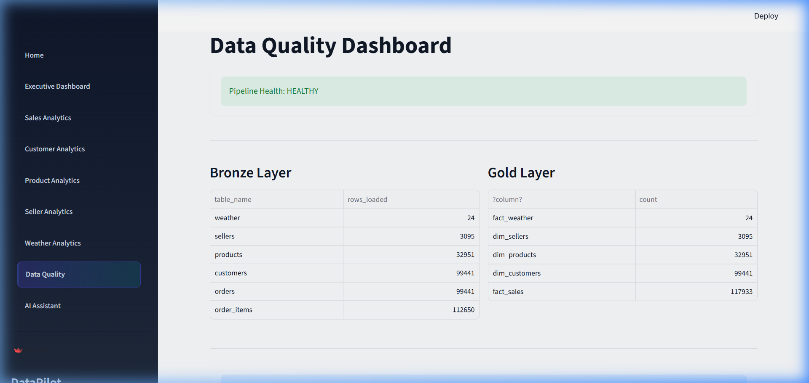
</p>

---

# 🎥 Demo

A complete walkthrough of DataPilot is available below.

> 📹 Demo Video *(Coming Soon)*

or

> 🎬 Watch the Demo: *(Add YouTube link here)*

```
https://youtu.be/your-demo-video
```

---

# 📈 Project Highlights

✔️ Modern Data Stack

✔️ Medallion Architecture

✔️ Apache Airflow

✔️ dbt Core

✔️ PostgreSQL Warehouse

✔️ Streamlit Dashboards

✔️ Multi-Agent AI Framework

✔️ Natural Language to SQL

✔️ Retrieval-Augmented Generation (RAG)

✔️ Pipeline Monitoring

✔️ Executive Report Generation

✔️ Dockerized Infrastructure

# 🏗️ Engineering Decisions

Building DataPilot involved selecting technologies and architectural patterns that reflect modern data engineering best practices. Rather than choosing tools based solely on popularity, each component was selected to solve a specific problem while ensuring scalability, maintainability, and extensibility.

---

## Why PostgreSQL?

PostgreSQL was selected as the analytical data warehouse because it offers a robust SQL engine, excellent performance, strong ACID compliance, and extensive support for analytical workloads.

It also integrates seamlessly with dbt, SQLAlchemy, Airflow, and Streamlit, making it an ideal choice for a modern analytics platform.

---

## Why Apache Airflow?

Scheduling data pipelines using shell scripts or cron jobs quickly becomes difficult to maintain as workflows grow.

Apache Airflow provides:

- Workflow orchestration
- Task dependency management
- Automatic retries
- Monitoring
- Logging
- Scheduling
- Extensibility

This makes the pipeline significantly more reliable and production-ready.

---

## Why dbt?

Instead of embedding transformation logic inside Python scripts or SQL files, DataPilot uses dbt to manage analytical transformations.

Benefits include:

- Modular SQL models
- Version-controlled transformations
- Automated testing
- Documentation generation
- Dependency management
- Incremental model support

This follows modern Analytics Engineering best practices.

---

## Why the Medallion Architecture?

Rather than storing all data in a single schema, DataPilot follows the Medallion Architecture.

This layered approach separates raw, cleaned, and business-ready datasets into independent stages.

### Bronze

Stores raw ingested data exactly as received.

### Silver

Cleans, validates, standardizes, and enriches the data.

### Gold

Contains business-ready datasets optimized for dashboards, reporting, and AI applications.

This design improves maintainability while preserving historical data for auditing and reproducibility.

---

## Why a Multi-Agent AI Framework?

Most AI-powered analytics applications rely on a single LLM to answer every user request.

DataPilot instead adopts a specialized **multi-agent architecture**, where each agent focuses on a single responsibility.

This provides several advantages:

- Better separation of concerns
- Easier maintenance
- Higher scalability
- Improved extensibility
- Independent testing of each agent
- Clear execution flow

Rather than one large agent handling everything, DataPilot allows multiple agents to collaborate through a shared execution context.

---

## Why Retrieval-Augmented Generation (RAG)?

Large Language Models are powerful, but they do not inherently understand project-specific documentation or implementation details.

To address this, DataPilot incorporates Retrieval-Augmented Generation (RAG).

Project documentation is indexed into a FAISS vector database, allowing the Knowledge Agent to retrieve relevant context before generating a response.

This improves:

- Accuracy
- Context-awareness
- Reliability
- Explainability

while reducing hallucinations.

---

## Why Streamlit?

Instead of building a traditional frontend using React or Angular, Streamlit was chosen because it enables rapid development of interactive analytical applications using Python.

This allows the entire platform—including dashboards, AI assistant, and business intelligence modules—to be developed within a unified technology stack.

---

## Why Docker?

Modern data platforms consist of multiple interconnected services.

Docker ensures every component—including PostgreSQL, Apache Airflow, pgAdmin, and supporting services—runs within isolated, reproducible environments.

This eliminates dependency conflicts and simplifies deployment across different operating systems.

---

## Why This Architecture?

The overall architecture was designed around three core principles:

### 📦 Modularity

Every major component—ingestion, warehouse, transformation, dashboards, and AI—is developed independently.

---

### 📈 Scalability

New data sources, dashboards, AI agents, and analytical models can be added without modifying existing components.

---

### 🔄 Extensibility

The platform is designed so that future technologies, cloud deployments, or additional AI agents can be integrated with minimal changes.

---

By combining these architectural decisions, DataPilot demonstrates how modern data engineering principles and Agentic AI can work together to build intelligent, scalable, and production-inspired analytics platforms.

# 🗺️ Project Roadmap

DataPilot was developed incrementally, with each milestone introducing a new capability while maintaining a modular and scalable architecture.

## ✅ Completed Milestones

### 🏗️ Foundation & Infrastructure

- [x] Project Architecture & Planning
- [x] Dockerized Development Environment
- [x] PostgreSQL Data Warehouse
- [x] Environment Configuration
- [x] Modular Project Structure

---

### 📥 Data Engineering

- [x] Automated Data Ingestion Pipelines
- [x] Weather API Integration
- [x] Warehouse Initialization
- [x] Data Validation
- [x] Logging Framework

---

### 🌪️ Workflow Orchestration

- [x] Apache Airflow Integration
- [x] Automated DAG Execution
- [x] Task Dependency Management
- [x] Retry & Failure Handling
- [x] Pipeline Monitoring

---

### 🔷 Analytics Engineering

- [x] Medallion Architecture
- [x] Bronze Layer
- [x] Silver Layer
- [x] Gold Layer
- [x] dbt Models
- [x] dbt Tests
- [x] Data Quality Validation

---

### 📊 Business Intelligence

- [x] Executive Dashboard
- [x] Sales Analytics
- [x] Customer Analytics
- [x] Product Analytics
- [x] Seller Analytics
- [x] Weather Analytics
- [x] Data Quality Dashboard

---

### 🤖 Agentic AI Framework

- [x] Agent Orchestrator
- [x] Shared Agent Context
- [x] Planner
- [x] Tool Registry
- [x] SQL Agent
- [x] Analytics Agent
- [x] Knowledge Agent (RAG)
- [x] Pipeline Agent
- [x] Report Agent
- [x] Google Gemini Integration

---

### 📚 Retrieval-Augmented Generation

- [x] Document Loader
- [x] Text Chunking
- [x] Embedding Generation
- [x] FAISS Vector Store
- [x] Semantic Retrieval
- [x] Knowledge Assistant

---

### 🚀 Platform Integration

- [x] AI Assistant
- [x] Dashboard Integration
- [x] Multi-Agent Execution
- [x] End-to-End Analytics Workflow

---

# 🔮 Future Enhancements

DataPilot has been designed with extensibility in mind. The following enhancements are planned for future iterations.

### ☁️ Cloud & Deployment

- [ ] AWS Deployment
- [ ] Azure Deployment
- [ ] Google Cloud Deployment
- [ ] Kubernetes
- [ ] Terraform Infrastructure

---

### ⚡ Data Engineering

- [ ] Kafka Streaming
- [ ] Real-Time Data Pipelines
- [ ] CDC (Change Data Capture)
- [ ] Delta Lake Support
- [ ] Iceberg Support

---

### 🤖 AI

- [ ] Multi-LLM Support
- [ ] Local LLM Integration
- [ ] AI Memory
- [ ] Autonomous Pipeline Optimization
- [ ] Conversational Analytics
- [ ] Chart Generation from Natural Language

---

### 📊 Analytics

- [ ] Predictive Analytics
- [ ] Demand Forecasting
- [ ] Customer Churn Prediction
- [ ] Recommendation Engine
- [ ] Anomaly Detection

---

### 🔒 Enterprise Features

- [ ] Authentication & Authorization
- [ ] Role-Based Access Control
- [ ] Audit Logging
- [ ] API Gateway
- [ ] CI/CD Pipeline
- [ ] Observability & Monitoring

---

## 🎯 Long-Term Vision

The long-term vision for **DataPilot** is to evolve from a production-inspired learning project into a comprehensive **AI-native Data Platform** capable of managing the complete data lifecycle—from ingestion and orchestration to intelligent analytics and autonomous decision support.

By combining modern data engineering principles with Agentic AI, DataPilot aims to demonstrate how future data platforms can move beyond traditional dashboards and become intelligent systems that actively assist users in understanding, analyzing, and acting on their data.

---

# 🤝 Contributing

Contributions are always welcome!

Whether you want to improve the platform, fix bugs, enhance documentation, or introduce new features, your contributions are greatly appreciated.

### How to Contribute

1. Fork the repository.
2. Create a new feature branch.

```bash
git checkout -b feature/your-feature-name
```

3. Commit your changes.

```bash
git commit -m "feat: add amazing feature"
```

4. Push the branch.

```bash
git push origin feature/your-feature-name
```

5. Open a Pull Request.

Please ensure your code follows the existing project structure and coding conventions.

---

# 🏆 Project Highlights

DataPilot demonstrates practical implementation of modern data engineering and AI concepts, including:

- Modern Data Stack Architecture
- Medallion Data Warehouse Design
- Apache Airflow Workflow Orchestration
- Analytics Engineering using dbt
- PostgreSQL Data Warehouse
- Interactive Business Intelligence Dashboards
- Multi-Agent AI Framework
- Natural Language to SQL
- Retrieval-Augmented Generation (RAG)
- AI-powered Pipeline Monitoring
- Executive Report Generation
- Dockerized Deployment

---

# 📚 What You'll Learn

DataPilot is intended as a practical learning resource for developers interested in:

- Data Engineering
- Analytics Engineering
- Data Warehousing
- Workflow Orchestration
- Modern Data Stack
- Business Intelligence
- Agentic AI
- Retrieval-Augmented Generation (RAG)
- LLM-powered Applications
- Production-inspired System Design

---

# 👨‍💻 About the Author

**Dheeraj Yadav**

B.Tech Computer Science & Engineering  
Indian Institute of Information Technology (IIIT) Bhagalpur

I'm passionate about building scalable data platforms that combine modern data engineering with artificial intelligence to solve real-world business problems. My interests include Data Engineering, Analytics Engineering, MLOps, Agentic AI, and Intelligent Decision Support Systems.

### Connect with Me

- 💼 LinkedIn: https://www.linkedin.com/in/dheerajyadav1/
- 💻 GitHub: https://github.com/Dheerajyadav1
- 📧 Email: your-email@example.com

---

# 🙏 Acknowledgements

This project would not have been possible without the incredible open-source community.

Special thanks to the teams behind:

- Apache Airflow
- dbt Labs
- PostgreSQL
- Streamlit
- Docker
- SQLAlchemy
- Plotly
- FAISS
- Google Gemini
- Pandas
- NumPy

Their contributions continue to shape the modern data engineering ecosystem.

---

# 📄 License

This project is licensed under the **MIT License**.

You are free to use, modify, and distribute this project in accordance with the terms of the license.

---

<div align="center">

## ⭐ Support the Project

If you found **DataPilot** useful or learned something from it, consider giving the repository a **star**.

Your support motivates future improvements and helps the project reach more developers.

### 🚀 DataPilot

**Intelligent Data Engineering & Analytics Platform**

*From Raw Data to Intelligent Decisions.*

Made with ❤️ by **Dheeraj Yadav**

</div>