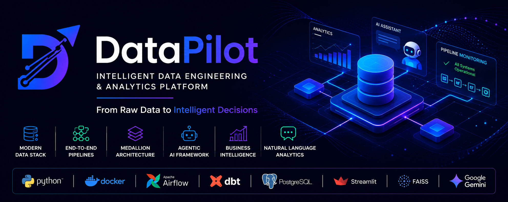
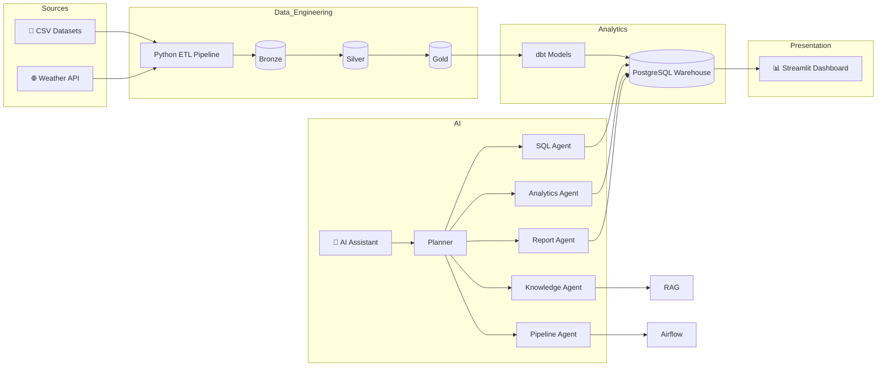
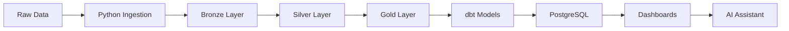

<div align="center">

# 🚀 DataPilot

### Intelligent Data Engineering & Analytics Platform

**From Raw Data to Intelligent Decisions**

*An end-to-end Modern Data Stack that combines Data Engineering, Analytics Engineering, Business Intelligence, and Agentic AI into a single intelligent analytics platform.*

<br>

<p align="center">

</p>

<br>


<br>


</div>

---

## 📌 Table of Contents

- [Overview](#-overview)
- [Why DataPilot](#-why-datapilot)
- [Key Features](#-key-features)
- [Technology Stack](#-technology-stack)
- [Project Highlights](#-project-highlights)

---

# 📖 Overview

Modern organizations rely on data to drive business decisions, yet building a complete analytics platform often requires combining multiple technologies for ingestion, orchestration, transformation, warehousing, visualization, and intelligence.

**DataPilot** brings these capabilities together into a single production-inspired platform.

It automates the complete data lifecycle—from raw data ingestion to AI-powered business insights—using a modern data stack built around **Apache Airflow**, **dbt**, **PostgreSQL**, **Streamlit**, and a custom **Multi-Agent AI Framework** powered by **Google Gemini**.

Unlike traditional dashboard-driven analytics platforms, DataPilot enables users to interact with their data using **natural language**, allowing business users and engineers to retrieve insights, generate SQL, monitor pipelines, access project knowledge, and create executive reports without manually navigating multiple tools.

The platform demonstrates how modern **Data Engineering**, **Analytics Engineering**, and **Agentic AI** can work together to create intelligent decision-support systems.

---

# 💡 Why DataPilot?

Most analytics projects stop after building dashboards.

DataPilot goes several steps further.

It demonstrates how a modern data platform can evolve into an **AI-native analytics ecosystem** where intelligent agents collaborate to automate analytical workflows, simplify data access, and assist users throughout the decision-making process.

Instead of asking users to learn SQL or understand database schemas, DataPilot enables them to simply ask questions such as:

> *"Show the top 10 customers by revenue."*

> *"Generate this month's executive sales report."*

> *"Is my Airflow pipeline healthy?"*

> *"Explain the Medallion Architecture used in this project."*

The platform automatically determines the user's intent, routes the request to the appropriate AI agent, gathers the required information, and produces a context-aware response.

This combination of modern data engineering and autonomous AI makes DataPilot more than a dashboard—it becomes an intelligent analytics assistant.

---

# ✨ Key Features

### 🏗️ Modern Data Engineering

- Automated Data Ingestion Pipelines
- Medallion Architecture (Bronze → Silver → Gold)
- PostgreSQL Data Warehouse
- Apache Airflow Workflow Orchestration
- dbt Transformations & Testing
- Incremental Data Processing
- Dockerized Infrastructure

---

### 📊 Business Intelligence

- Executive Dashboard
- Sales Analytics
- Customer Analytics
- Product Analytics
- Seller Analytics
- Weather Analytics
- Data Quality Dashboard

---

### 🤖 Agentic AI

- Multi-Agent Orchestration
- Natural Language to SQL
- Business Analytics Agent
- Knowledge Agent (RAG)
- Pipeline Monitoring Agent
- Executive Report Generation
- Shared Agent Context
- Dynamic Request Routing

---

### ⚙️ Platform Capabilities

- End-to-End Data Pipeline
- AI-Powered Analytics
- Interactive Dashboards
- Automated Workflow Scheduling
- Intelligent Pipeline Monitoring
- Retrieval-Augmented Generation
- Context-Aware AI Responses
- Modular & Extensible Architecture

---

# 🛠️ Technology Stack

| Category | Technologies |
|-----------|--------------|
| **Programming Language** | Python 3.11 |
| **Data Warehouse** | PostgreSQL |
| **Workflow Orchestration** | Apache Airflow |
| **Transformation Layer** | dbt Core |
| **Business Intelligence** | Streamlit + Plotly |
| **Artificial Intelligence** | Google Gemini |
| **Vector Database** | FAISS |
| **Data Processing** | Pandas, NumPy |
| **Database Toolkit** | SQLAlchemy |
| **Containerization** | Docker & Docker Compose |
| **API Integration** | Requests, HTTPX |

---

# 🚀 Project Highlights

<table>
<tr>

<td align="center" width="25%">

### 🏗️

**Modern Data Stack**

Production-inspired architecture using Airflow, dbt, PostgreSQL, and Docker.

</td>

<td align="center" width="25%">

### 🤖

**Agentic AI**

A multi-agent framework capable of SQL generation, analytics, RAG, reporting, and pipeline monitoring.

</td>

<td align="center" width="25%">

### 📊

**Business Intelligence**

Interactive dashboards delivering actionable insights across multiple business domains.

</td>

<td align="center" width="25%">

### 🚀

**Scalable Design**

Modular architecture designed for extensibility, maintainability, and future cloud deployment.

</td>

</tr>
</table>

---

# 🏛️ Architecture & Engineering

DataPilot is designed as a modular, production-inspired data platform where every layer has a single responsibility. The platform separates data ingestion, transformation, analytics, visualization, and AI into independent components, making it scalable, maintainable, and easy to extend.

---

# 🏗️ High-Level System Architecture



---

# ⚙️ Data Pipeline

Every dataset follows a structured journey before becoming available for analytics and AI.



### Pipeline Stages

| Stage | Purpose |
|--------|---------|
| **Ingestion** | Collects data from CSV files and external APIs |
| **Bronze** | Stores raw, immutable source data |
| **Silver** | Cleans, validates, and standardizes data |
| **Gold** | Creates analytics-ready datasets |
| **dbt** | Applies business transformations and quality tests |
| **Warehouse** | Stores curated datasets inside PostgreSQL |
| **Presentation** | Serves dashboards and AI agents |

---

# 🥉 Medallion Architecture

DataPilot follows the **Bronze → Silver → Gold** architecture to progressively improve data quality.

```text
Raw Sources
     │
     ▼
 Bronze
     │
     ▼
 Silver
     │
     ▼
  Gold
     │
     ├────────► Dashboards
     │
     └────────► AI Assistant
```

| Layer | Responsibility |
|--------|---------------|
| 🥉 Bronze | Raw ingested data with minimal transformation |
| 🥈 Silver | Cleaned, standardized, validated datasets |
| 🥇 Gold | Business-ready analytical models |

This layered design improves maintainability, enables reproducibility, and preserves historical data.

---

# 🤖 Multi-Agent AI Architecture

Unlike traditional AI applications that rely on a single LLM, DataPilot uses a **Planner-based Multi-Agent Architecture**.

Each agent is responsible for a specialized task while sharing a common execution context.

```mermaid
flowchart TD

User

↓

Planner

↓

SQL Agent

Analytics Agent

Knowledge Agent

Pipeline Agent

Report Agent

↓

Shared Context

↓

Final Response
```

---

## AI Agent Responsibilities

| Agent | Responsibility |
|--------|---------------|
| 🧠 Planner | Determines user intent and selects the appropriate execution strategy |
| 💻 SQL Agent | Converts natural language into optimized SQL queries |
| 📊 Analytics Agent | Performs business analysis and generates insights |
| 📚 Knowledge Agent | Retrieves project-specific information using RAG |
| ⚙️ Pipeline Agent | Monitors Airflow, dbt, and pipeline health |
| 📄 Report Agent | Produces executive business reports |

---

# 🔄 Request Lifecycle

Every user request follows a structured execution pipeline.

```text
User Request

↓

Planner

↓

Relevant AI Agent(s)

↓

PostgreSQL / Airflow / FAISS

↓

Shared Context

↓

Final AI Response
```

This orchestration layer allows multiple AI agents to collaborate while remaining independent and reusable.

---

# 📂 Project Structure

```text
DataPilot/

├── agents/                 # Multi-Agent AI Framework

├── app/                    # Streamlit Dashboard

├── config/                 # Configuration

├── dags/                   # Airflow DAGs

├── dbt_project/            # dbt Models & Tests

├── docker/                 # Docker Configuration

├── docs/                   # Project Documentation

├── ingestion/              # Data Ingestion

├── warehouse/              # Warehouse Pipeline

├── tests/                  # Unit Tests

├── requirements.txt

├── docker-compose.yml

└── README.md
```

---

# ⚡ Engineering Decisions

Building DataPilot involved selecting technologies based on scalability, maintainability, and production best practices.

| Technology | Why It Was Chosen |
|------------|-------------------|
| **PostgreSQL** | Reliable analytical database with excellent SQL support |
| **Apache Airflow** | Workflow orchestration and scheduling |
| **dbt** | Modular SQL transformations with built-in testing |
| **Docker** | Reproducible development and deployment environments |
| **Streamlit** | Rapid development of interactive BI applications |
| **FAISS** | Efficient vector similarity search for RAG |
| **Google Gemini** | Natural language reasoning and agent execution |

📖 **Detailed architecture and design decisions are available in the [`docs/`](docs/) directory.**

---

# 🎯 Design Principles

DataPilot was built around five core engineering principles.

### 🧩 Modularity

Every component is independently developed and maintained.

### 📈 Scalability

The architecture supports additional data sources, AI agents, dashboards, and analytical models.

### 🔄 Extensibility

New capabilities can be integrated without affecting existing modules.

### 🛡️ Reliability

Data quality checks, workflow orchestration, and structured logging ensure robust execution.

### 🤖 Intelligence

A planner-driven multi-agent framework enables context-aware analytics instead of isolated AI responses.

---

# 🚀 Getting Started

Get **DataPilot** up and running in just a few steps.

---

# 📋 Prerequisites

Ensure the following software is installed before running the project.

| Software | Version |
|----------|---------|
| Python | 3.11+ |
| Docker | Latest |
| Docker Compose | Latest |
| Git | Latest |

---

# ⚡ Quick Start

### 1️⃣ Clone the Repository

```bash
git clone https://github.com/<your-username>/DataPilot.git

cd DataPilot
```

---

### 2️⃣ Create a Virtual Environment

Windows

```bash
python -m venv .venv

.venv\Scripts\activate
```

Linux / macOS

```bash
python3 -m venv .venv

source .venv/bin/activate
```

---

### 3️⃣ Install Dependencies

```bash
pip install -r requirements.txt
```

---

### 4️⃣ Configure Environment Variables

Create a `.env` file in the project root.

```env
POSTGRES_HOST=

POSTGRES_PORT=

POSTGRES_DB=

POSTGRES_USER=

POSTGRES_PASSWORD=

PGADMIN_DEFAULT_EMAIL=

PGADMIN_DEFAULT_PASSWORD=

AIRFLOW_UID=

GEMINI_API_KEY=
```

---

### 5️⃣ Start the Infrastructure

```bash
docker compose up -d
```

This starts:

- 🐘 PostgreSQL
- 🌪️ Apache Airflow
- 🖥️ pgAdmin

---

### 6️⃣ Build the Warehouse

```bash
python warehouse/pipeline.py
```

---

### 7️⃣ Run Data Ingestion

```bash
python ingestion/pipeline.py
```

---

### 8️⃣ Execute dbt Models

```bash
cd dbt_project

dbt run

dbt test
```

---

### 9️⃣ Build the Knowledge Base

```bash
python -m agents.rag.build_index
```

---

### 🔟 Launch the Dashboard

```bash
streamlit run app/Home.py
```

Open:

```
http://localhost:8501
```

🎉 You're ready to explore DataPilot!

---

# 🤖 AI Assistant

DataPilot includes a planner-driven **Multi-Agent AI Assistant** that enables users to interact with the platform using natural language.

Instead of writing SQL or manually navigating dashboards, simply ask questions such as:

---

### 📊 Business Analytics

> Show the top 10 customers by revenue.

✔ Generates SQL

✔ Executes query

✔ Returns results

✔ Provides business insights

---

### 📈 Trend Analysis

> What are the monthly revenue trends?

✔ Retrieves historical data

✔ Identifies growth patterns

✔ Highlights anomalies

✔ Suggests recommendations

---

### 📚 Knowledge Retrieval

> Explain the Medallion Architecture.

✔ Searches the project knowledge base

✔ Retrieves relevant documentation

✔ Generates context-aware explanations using RAG

---

### ⚙️ Pipeline Monitoring

> Is my Airflow pipeline healthy?

✔ Checks Airflow

✔ Reviews dbt status

✔ Reports pipeline health

✔ Highlights failures

---

### 📄 Executive Reporting

> Generate a quarterly business report.

✔ Performs analytics

✔ Summarizes KPIs

✔ Generates executive-ready reports

---

# 💬 Example Queries

### SQL

```text
Show the top 10 customers by revenue.
```

```text
List sellers from São Paulo.
```

---

### Analytics

```text
Which product category generated the highest sales?
```

```text
Show monthly sales trends.
```

---

### Knowledge

```text
Explain the Medallion Architecture.
```

```text
How does the SQL Agent work?
```

---

### Pipeline

```text
Is Airflow running?
```

```text
Did dbt tests pass?
```

---

### Reports

```text
Generate an executive sales report.
```

```text
Summarize this month's business performance.
```

---

# 📸 Platform Showcase

Below are some of the key modules available in DataPilot.

| Module | Preview |
|---------|---------|
| 🏠 Home | `assets/screenshots/home.png` |
| 📊 Executive Dashboard | `assets/screenshots/executive-dashboard.png` |
| 💰 Sales Analytics | `assets/screenshots/sales-dashboard.png` |
| 👥 Customer Analytics | `assets/screenshots/customer-dashboard.png` |
| 📦 Product Analytics | `assets/screenshots/product-dashboard.png` |
| 🛍️ Seller Analytics | `assets/screenshots/seller-dashboard.png` |
| 🌦️ Weather Analytics | `assets/screenshots/weather-dashboard.png` |
| 🤖 AI Assistant | `assets/screenshots/ai-assistant.png` |
| ⚙️ Pipeline Monitoring | `assets/screenshots/pipeline-monitoring.png` |

> 💡 *Replace the placeholders above with actual screenshots after capturing the application.*

---

# 📚 Documentation

Detailed documentation is available in the **docs/** directory.

| Guide | Description |
|--------|-------------|
| 📖 Architecture Guide | System architecture and design |
| 🤖 AI Framework | Multi-agent architecture |
| 🥉 Medallion Architecture | Warehouse design |
| ⚙️ Pipeline Guide | ETL workflow |
| 🛠️ Engineering Decisions | Technology choices |
| 🚀 Deployment Guide | Production deployment |

---

# ❓ Frequently Asked Questions

### Why PostgreSQL instead of MySQL?

PostgreSQL provides advanced SQL capabilities, better analytical performance, and excellent compatibility with dbt and Airflow.

---

### Why use dbt?

dbt enables modular SQL transformations, automated testing, documentation, and analytics engineering best practices.

---

### Why a Multi-Agent AI framework?

Specialized agents improve scalability, maintainability, and allow complex analytical tasks to be solved collaboratively instead of relying on a single LLM.

---

### Can DataPilot be deployed to the cloud?

Yes. The platform is designed with cloud deployment in mind and can be extended to AWS, Azure, or Google Cloud with minimal architectural changes.

---

# 🗺️ Roadmap

DataPilot has been developed incrementally, with each milestone introducing new capabilities while maintaining a modular and scalable architecture.

## ✅ Completed

### 🏗️ Platform Foundation

- [x] Project Architecture
- [x] Modular Codebase
- [x] Dockerized Development Environment
- [x] Configuration Management
- [x] Logging Framework

---

### 📥 Data Engineering

- [x] Automated Data Ingestion
- [x] PostgreSQL Data Warehouse
- [x] Medallion Architecture
- [x] Incremental Data Processing
- [x] Weather API Integration

---

### 🌪️ Workflow Orchestration

- [x] Apache Airflow Integration
- [x] Automated DAG Execution
- [x] Task Dependency Management
- [x] Pipeline Monitoring

---

### 🔷 Analytics Engineering

- [x] dbt Models
- [x] dbt Tests
- [x] Data Quality Validation
- [x] Analytics-ready Gold Layer

---

### 📊 Business Intelligence

- [x] Executive Dashboard
- [x] Sales Analytics
- [x] Customer Analytics
- [x] Product Analytics
- [x] Seller Analytics
- [x] Weather Analytics
- [x] Data Quality Dashboard

---

### 🤖 Agentic AI

- [x] Planner Agent
- [x] SQL Agent
- [x] Analytics Agent
- [x] Knowledge Agent (RAG)
- [x] Pipeline Agent
- [x] Report Agent
- [x] Dynamic Agent Routing
- [x] Shared Execution Context

---

## 🚀 Next Milestones

The platform has been designed for future expansion. Planned enhancements include:

### ☁️ Cloud & DevOps

- [ ] AWS Deployment
- [ ] Azure Deployment
- [ ] Google Cloud Deployment
- [ ] Kubernetes
- [ ] CI/CD Pipeline
- [ ] Infrastructure as Code (Terraform)

---

### ⚡ Streaming & Real-Time Analytics

- [ ] Apache Kafka
- [ ] Change Data Capture (CDC)
- [ ] Real-Time Dashboards
- [ ] Event-Driven Pipelines

---

### 🤖 Advanced AI

- [ ] Multi-LLM Support
- [ ] Local LLM Integration
- [ ] Conversational Memory
- [ ] Autonomous Pipeline Optimization
- [ ] AI-generated Dashboards
- [ ] Natural Language Chart Generation

---

### 📈 Advanced Analytics

- [ ] Sales Forecasting
- [ ] Customer Churn Prediction
- [ ] Demand Forecasting
- [ ] Recommendation Engine
- [ ] Anomaly Detection

---

# 🎯 Long-Term Vision

DataPilot began as a project to explore modern data engineering practices but evolved into a broader vision: building an **AI-native analytics platform** where intelligent agents work alongside modern data infrastructure to simplify decision-making.

The long-term objective is to transform DataPilot into a comprehensive platform capable of managing the entire data lifecycle—from ingestion and orchestration to intelligent analytics, automated reporting, and autonomous decision support.

---

# 🤝 Contributing

Contributions are always welcome!

Whether you want to improve the platform, add new AI agents, optimize pipelines, enhance dashboards, or improve documentation, your contributions are appreciated.

### Getting Started

1. Fork the repository.
2. Create a new feature branch.

```bash
git checkout -b feature/awesome-feature
```

3. Commit your changes.

```bash
git commit -m "feat: add awesome feature"
```

4. Push to your branch.

```bash
git push origin feature/awesome-feature
```

5. Open a Pull Request.

Please ensure that your code follows the existing project structure and coding conventions.

---

# 📊 Project Statistics

| Metric | Value |
|---------|------:|
| Programming Language | Python |
| Architecture | Medallion |
| Database | PostgreSQL |
| Workflow Engine | Apache Airflow |
| Transformation Tool | dbt |
| Dashboard Framework | Streamlit |
| AI Framework | Multi-Agent |
| Vector Store | FAISS |
| Containerization | Docker |

> 💡 *You can enhance this section later with GitHub Actions badges, code coverage, repository statistics, and automated metrics.*

---

# 🌟 Key Takeaways

DataPilot demonstrates practical implementation of:

- Modern Data Engineering
- Analytics Engineering
- Workflow Orchestration
- Data Warehousing
- Business Intelligence
- Agentic AI
- Retrieval-Augmented Generation (RAG)
- Natural Language to SQL
- AI-powered Business Analytics
- Production-inspired System Design

---

# 👨‍💻 Author

<div align="center">

## Dheeraj Yadav

**B.Tech Computer Science & Engineering**  
**Indian Institute of Information Technology (IIIT) Bhagalpur**

*Aspiring Data Engineer | Analytics Engineer | AI Engineer*

</div>

I enjoy building scalable data platforms that combine modern data engineering with artificial intelligence to solve real-world business problems. My interests include Data Engineering, Analytics Engineering, MLOps, Agentic AI, and Intelligent Decision Support Systems.

### 📬 Connect with Me

<p align="left">

<a href="https://github.com/Dheerajyadav1">

</a>

<a href="https://www.linkedin.com/in/dheerajyadav1/">

</a>

<a href="mailto:your-email@example.com">

</a>

</p>

---

# 🙏 Acknowledgements

DataPilot builds upon the incredible work of the open-source community.

Special thanks to the teams behind:

- Apache Airflow
- dbt Labs
- PostgreSQL
- Streamlit
- Docker
- SQLAlchemy
- Plotly
- FAISS
- Google Gemini
- Pandas
- NumPy

Their tools and communities continue to advance the field of modern data engineering.

---

# 📄 License

This project is licensed under the **MIT License**.

Feel free to use, modify, and distribute this project in accordance with the license terms.

---

<div align="center">

# ⭐ Support DataPilot

If you found this project useful, informative, or inspiring, consider giving it a ⭐ on GitHub.

Your support motivates continued development and helps others discover the project.

---

### 🚀 DataPilot

**Intelligent Data Engineering & Analytics Platform**

*From Raw Data to Intelligent Decisions.*

*"Building the future of analytics—one intelligent pipeline at a time."*

Made with ❤️ by **Dheeraj Yadav**

</div>